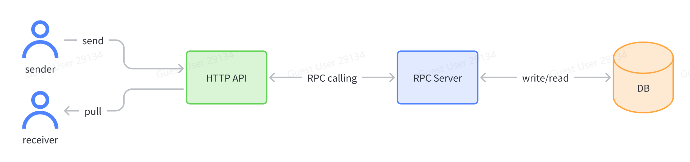
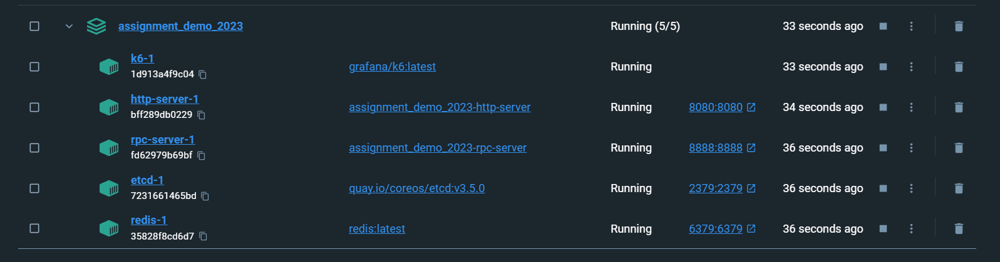
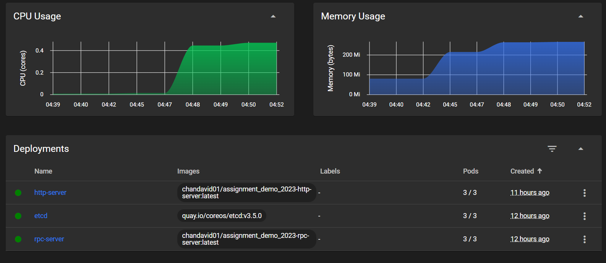
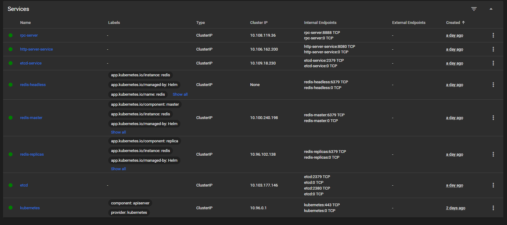
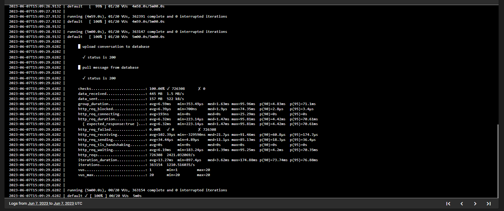
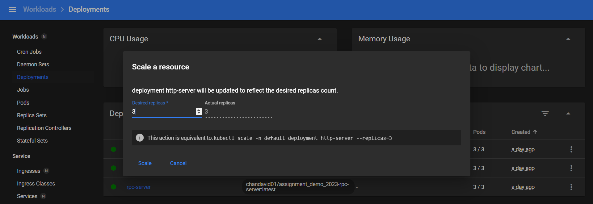
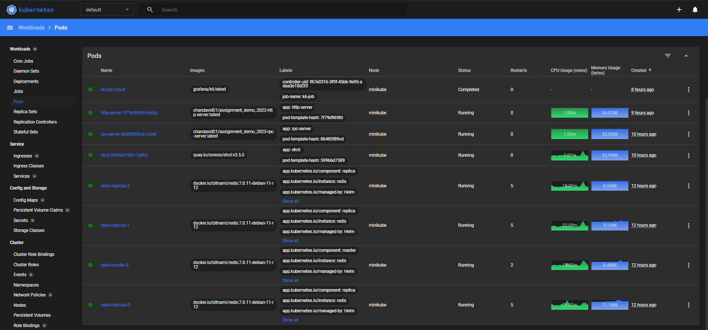

# TikTok_Tech_Immersion_Assignment_2023


## Table of Contents
- [High Level of Instant Messaging System Architecture](#high-level-of-instant-messaging-system-architecture)
- [Data Storage](#data-storage)
- [Message Delivery](#message-delivery)
    - [Testing](#testing)
    - [Send API](#send-api)
        - [Request](#request)
        - [Request Payload Parameters](#request-payload-parameters)
        - [Request Payload Sample](#request-payload-sample)
        - [Response](#response)
    - [Pull API](#pull-api)
        - [Request](#request-1)
        - [Request Payload Parameters](#request-payload-parameters-1)
        - [Request Payload Sample](#request-payload-sample-1)
        - [Response](#response-1)
    - [Flow](#flow)
    - [Launch using Docker-Compose](#launch-using-docker-compose)
        - [Prerequisites](#prerequisites)
- [Performance and Scalability](#performance-and-scalability)
    - [Deployment Instructions](#deployment-instructions)
        - [Prerequisities](#prerequisites-1)
        - [Step-by-step manual to deploy the services in Kubernetes](#step-by-step-manual-to-deploy-the-redis-server-etcd-and-k6-in-kubernetes-under-default-namespace)
- [Acknowledgements](#acknowledgements)
    - [Code References](#code-references)

# High Level of Instant Messaging System Architecture

The system consists of two services: 
1.  HTTP server using Kitex
2.  RPC server using Hertz

The HTTP API adheres to a defined Interface Definition Language (IDL). For this assignment, the RPC IDL of choice is *Thrift*, and you can find the relevant IDL file [idl_rpc.thrift](idl_rpc.thrift).

# Data Storage
The system utilizes **Redis**, an OLTP (Online Transaction Processing) database for storing message data. 

Redis offers fast read and write operations. It is able to handle a high volume of requests per second. Additionally, Redis supports horizontal scalability through clustering, allowing developers to distribute the data across multiple Redis nodes. This enables developers to handle increasing message loads and provides fault tolerance by replicating data across nodes.

When considering the data storage solution for this project, Redis emerges as a strong choice due to its **high performance, data persistence, rich features, scalability, and wide adoption** in the developer community.

# Message Delivery
The system ensures timely and consistent message delivery to recipients using a PULL mode approach. This means that there is no need to maintain a constant connection and push new messages in real-time. Instead, receivers can retrieve messages by utilizing the pull API, allowing them to fetch messages on demand.

**This messaging system allows users to send and pull messages using HTTP APIs.**

## Testing

You can test the messaging system by sending HTTP requests to the provided APIs using tools like cURL or Postman.

I used [Postman Desktop App](https://www.postman.com/downloads/) to test both APIs. You can refer this [json](msgsys.postman_collection.json) file to make a quick import and test.

### Unit Testing for RPC Server

In the [unit test](https://github.com/melvincwng/tiktok_assignment_demo_2023/blob/main/rpc-server/handler_test.go)  provided by [melvincwng](http://github.com/melvincwng), running `go test rpc-server/handler_test.go` only executes the tests defined in the specific `handler_test.go` file. This command will only focus on the test file itself and assume that the necessary dependencies are already imported or available in the project. Therefore, the errors due to redeclarations and unknown fields in the `rpc-server` package scope will be ignored.

To ensure comprehensive testing coverage of the entire package, I recommend using the command `go test github.com/TikTokTechImmersion/assignment_demo_2023/rpc-server`. This command allows the tests to traverse through the entire `rpc-server` package.

I made an attempt to write my own unit tests and tried to mock Redis, but I encountered difficulties in executing them. As a result, I have kept only the two test cases that passed, while commenting out the rest. 

If anyone has knowledge on how to debug this issue, I would greatly appreciate your assistance.

## Send API

Users can send a message by sending an HTTP POST request to `/api/send`.

### Request

- Method: POST
- URL (absolute path): `/api/send`

#### Request Payload Parameters

| Name    | Type   | Description          | 
| - |  | | 
| Chat  | string | Sender Identifier : Receiver Identifier    |
| Sender| string | Sender Identifier  |
| Text    | string | Message Text Content |

#### Request Payload Sample

```json
{
    "chat": "a:b",
    "sender": "a",
    "text": "Hi b, I'm a!"
}
```
#### Response
HTTP Status Code: 200
Response Body: None

## Pull API

Users can pull messages from a chat room by sending an HTTP GET request to `/api/pull`.

### Request

- Method: GET
- URL (absolute path): `/api/pull`

#### Request Payload Parameters

| Name    | Type    | Description                                | Comment                   |
| - | - | | - |
| Chat    | string  | Sender Identifier : Receiver Identifier    |                           |
| Cursor  | int64     | Starting position of messages (inclusive)  | Default: 0                |
| Limit   | int64     | Maximum number of messages per request     | Default: 10               |
| Reverse | boolean | Sort order of results                      | Default: false            |

### Request Payload Sample
```json
{
    "chat": "a:b",
    "cursor": 0,
    "limit": 2,
    "reverse": true
}
```
#### Response
HTTP Status Code: 200

The response will contain the following data:

| Name        | Type    | Description                      |
| -- | - | -- |
| Messages    | array[]   | List of messages                 |
| Has_more    | boolean | Indicates if there are more messages to pull |
| Next_cursor | int64    | Starting position of next page (inclusive) |

Response Body:
```json
{
    "messages": [
        {
            "chat": "a:b",
            "text": "hi b, I'm a!",
            "sender": "a",
            "send_time": 1684770951
        },
        {
            "chat": "a:b",
            "text": "hi a!",
            "sender": "b",
            "send_time": 1684770116
        }
    ],
    "has_more": true,
    "next_cursor": 2
}
```
*\**Although it is uncommon to include a data body in a "GET" request, the HTTP code provided in the demo follows this approach. Besides, the instructions explicitly state not to modify the code of the HTTP server.* 

## Flow

1. The user initiates an HTTP request to the HTTP server, which acts as a gateway for processing HTTP requests and responses.
2. The HTTP server communicates with the microservices hosted in the rpc-server, where the business logic as well as the modified code resides.
3. The rpc-server receives and handles the request by performing either a `Send (SendRequest)` or `Pull (PullRequest)` operation.
4. In the case of `Send (SendRequest)`, the rpc-server writes messages to the Redis server, while `Pull (PullRequest)` reads messages from Redis.
5. The retrieved data is then passed back to the HTTP server, which formulates an HTTP response and sends it back to the client.

For more detailed information, please refer to the API specification file, [idl_http.proto](idl_http.proto).

## Launch using Docker-Compose

### Prerequisites:
- [Docker Desktop](https://www.docker.com/products/docker-desktop/) 
- Docker VS Code Extension

You can either execute the command `docker-compose -f docker-compose.yml up` or simply right-click on your [docker-compose.yml](docker-compose.yml) file and choose the option to "compose up" from the context menu.


# Performance and Scalability
The system is designed to handle a large number of users and messages while maintaining optimal performance. It is specifically designed to support more than 20 concurrent users, ensuring that the system remains efficient and scalable during high load situations.

I use **k6** to conduct performance test, including smoke test, load test and **stress test**.

Later, I deploy the backend services to **Kubernetes** for **scaling** purpose.
## Deployment Instructions
### Prerequisites:
- [Docker Desktop](https://www.docker.com/products/docker-desktop/)
- [K6](https://k6.io/docs/get-started/installation/)
- [Minikube](https://minikube.sigs.k8s.io/docs/start/)
- [Kubectl](https://kubernetes.io/docs/tasks/tools/)
- [Helm](https://helm.sh/docs/intro/install/)

Before starting to deploy, you can open up Kubernetes dashboard for visualization by using `minikube start`, `minikube addons enable metrics-server` and `minikube dashboard` command.

### Step-by-step manual to deploy the redis, server, etcd, and k6 in Kubernetes under default namespace:

1. **Deploy redis:**
   - To install the chart with the release name `redis`:
   ```helm install redis oci://registry-1.docker.io/bitnamicharts/redis --set auth.enabled=false```
    or
   - ```helm repo add bitnami https://charts.bitnami.com/bitnami```
    ```helm upgrade redis bitnami/redis -f helm/redis.yaml```
    ```helm install redis bitnami/redis -f helm/redis.yaml```

2. **Deploy etcd:**
   - Apply the deployment using the `kubectl apply -f etcd.yaml` command.
   - Verify that the etcd pods are running using `kubectl get pods`.

3. **Deploy the rpc-server and http-server:**
   - Apply the deployment using the `kubectl apply -f rpc-server.yaml` and followed by `kubectl apply -f http-server.yaml`command.
   - Verify that the server pods are running using `kubectl get pods`.
    


4. **Expose the server as a service:**
   - Each service manifest has been configured together with its own deployment manifests.
   - Verify that the service is created and accessible using `kubectl get services`.
   

5. **Deploy k6:**
   - Apply the deployment using the `kubectl apply -f k6.yaml` command.
   - Verify that the k6 pods are running using `kubectl get pods`.
   - Verify the script is being run in the pod

        

6. **(Optional) Expose k6 as a service:**
   - If you want to access k6 externally, create a service YAML file, e.g., `k6-service.yaml`.
   - Configure the service by specifying the type (e.g., ClusterIP or NodePort), ports, and selector to target the k6 deployment.
   - Apply the service using the `kubectl apply -f k6-service.yaml` command.
   - Verify that the service is created and accessible using `kubectl get services`.

That's it! You now have the server, redis, etcd, and k6 deployed in Kubernetes. You can access the server through its service, and if you exposed k6 as a service, you can also access it externally. 

Furthermore, you can scale the services to during high load situation to keep them reliable and stable.


Make sure to adjust the YAML files and configurations according to your specific setup and requirements.



## Acknowledgements

### Code References

- [RPC Server Modification](https://github.com/weixingp/tiktok-tech-immersion-2023) by [weixingp](https://github.com/weixingp)
  - Description: The modification of rpc server was adapted from the code provided by weixingp. It helped in developing the connection between rpc-server and redis.
  - [Lark Document Reference](https://o386706e92.larksuite.com/docx/QE9qdhCmsoiieAx6gWEuRxvWsRc)
- [Unit Test for handler_test.go](https://github.com/melvincwng/tiktok_assignment_demo_2023/blob/main/rpc-server/handler_test.go) by [melvincwng](http://github.com/melvincwng)
